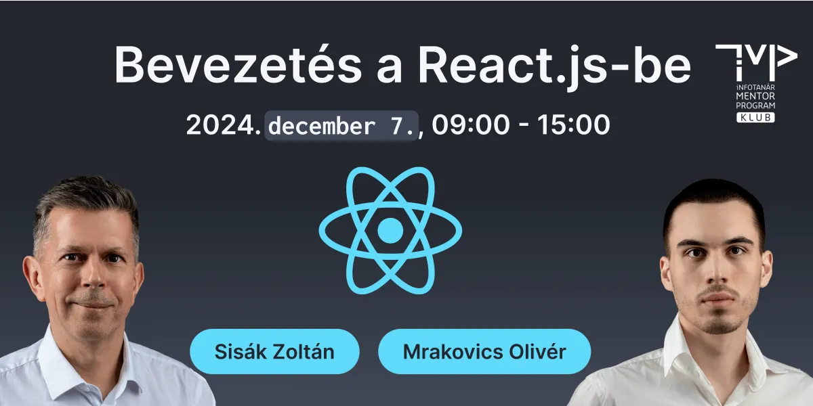

# ITMP Klub képzés infotanároknak - Bevezetés a React.js-be

**2024. december 7., szombat**

Az ősz beköszöntével egy újabb izgalmas képzéssel jelentkezünk. Az ITMP Klub keretében egy egynapos, React alapozó képzést szervezünk, amelyen természetesen ingyenesen vehetnek részt klubtagjaink.

Talán eddig azt gondoltad, hogy a React csak a haladó frontend fejlesztők eszköze, ezért soha nem is próbálkoztál vele. Itt az idő, hogy bebizonyítsuk, hogy a React segítségével könnyedén fejleszthetsz a interaktív webalkalmazásokat. Ebben vezető mentorként Sisák Zoltán és WorldSkills aranyérmes webfejlesztő versenyzője, Mrakovics Olivér lesz a segítségünkre.

A React ma már elengedhetetlen eszköze a modern webfejlesztésnek, és a képzés során lehetőséged lesz megismerni a React alapjait, megtanulni, hogyan lehet komponenseket létrehozni, és megtapasztalni, milyen módon egyszerűsítheti a felhasználói felületek fejlesztését. A frontend fejlesztésre használható JS keretrendszerek valamelyikével a szoftverfejlesztő- és tesztelő technikusoknak is meg kell ismerkednie, így a képzés különösen ajánlott azoknak, akik ezt a témakört oktatják valamelyik technikumban.

Az ismertetők és élő bemutatókon túl – ahogy azt már az ITMP-kurzusokon megszokhattátok – a gyakorlatban is kipróbálhatjátok a frissen megszerzett tudást. Ebben felkészült és lelkes mentoraink lesznek a segítségetekre.

**A továbbképzés időpontja:** 2024. december 7. (szombat) 9:00-15:00

**A továbbképzés formája:** online (Microsoft Teams meeting)

**A képzés tervezett tematikája és ütemezése:**

| Időpont           | Téma                                                                    |
| ----------------- | ----------------------------------------------------------------------- |
| _09:00 - 09:15_   | _Köszöntő, technikai információk_                                       |
| **09:15 - 11:00** | **1. modul – React és JSX**                                             |
| 09:15 - 09:45     | 1. modul elméleti áttekintés - Sisák Zoltán és Mrakovics Olivér         |
| 09:45 - 10:45     | 1. modul workshop - kiscsoportos, mentorált gyakorlat                   |
| _10:45 - 11:00_   | _Kávészünet_                                                            |
| **11:00 - 13:30** | **2. modul - Komponensek, prop-ok és állapotkezelés**                   |
| 11:00 - 11:30     | 2. modul elméleti áttekintés és demó - Sisák Zoltán és Mrakovics Olivér |
| 11:30 - 12:30     | 2. modul workshop - kiscsoportos, mentorált gyakorlat                   |
| _12:30 - 13:30_   | _Ebédszünet_                                                            |
| **13:30 - 14:45** | **3. modul - Űrlap-, esemény- és haladó állapotkezelés**                |
| 13:30 - 14:00     | 3. modul elméleti áttekintés és demó - Sisák Zoltán és Mrakovics Olivér |
| 14:00 - 14:45     | 3. modul workshop - kiscsoportos, mentorált gyakorlat                   |
| _14:45 - 15:00_   | _Kérdések és válaszok, napzárás_                                        |
